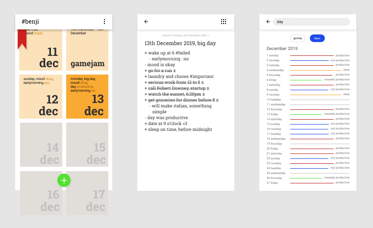

# benji
Benji a productivity app with aimed at intentional, minimalist journaling.
Benji is named after ______, a ______ - a man who definitely knew how to manage his day.

I have been daily journalling since I was 18. However I always used notebooks and journals. There are a lot of things about using "material" journals that I liked. There is something about writing you tasks and entries, that makes the process intentional and mean more. Also a books is more flexible. However I was also looking at apps the entire time, since I couldn't ignore the obvious benefits of digital apps. Having ease of access, ability to more interactively track your progess, or things like setting reminders etc. I couldn't find something that had the perfect blend of both the features.    
What I required was an app that didn't feel too artificial will all the button, which made writing down tasks mean something more.

Enter benji.

FEATURES:
1) Write your task in a single place, using simple constructs.
2) Navigate through a minimalist UI with the exact amount of features required.
3) Use the app as a daily journal. And also have the ability to set sprints/projects, write notes etc.
4) Extract information, from your tasks written in natural language. This information is then used to set reminders for your task and habits. Apart from this other general information is also gathered and use to help with your experience.
5) Using simple constructs to set key : value pairs, that can be used to track your progress, and help you organise your tasks.

### The How
Benji uses a simple four point system:
1) Write a title for your app. It can be the date for daily journaling, "habit" for habits or any name for timed sprints/projects. After the title.you can also include other tags.
2) Start a task with a "+". Use natural language. Eg. "go for flamenco class at 4". Reminders will also be set for you.
3) Start a comment with the "-". You can include information about your day/projects that can be use to track your progess. Eg "mood is good, "day was productive", "did gym today, trainedpart:chest" etc.
4) Use #hashtags to tag your app. Eg. #goals, #google

#### The magic of machine learning:

### Conclusion 

